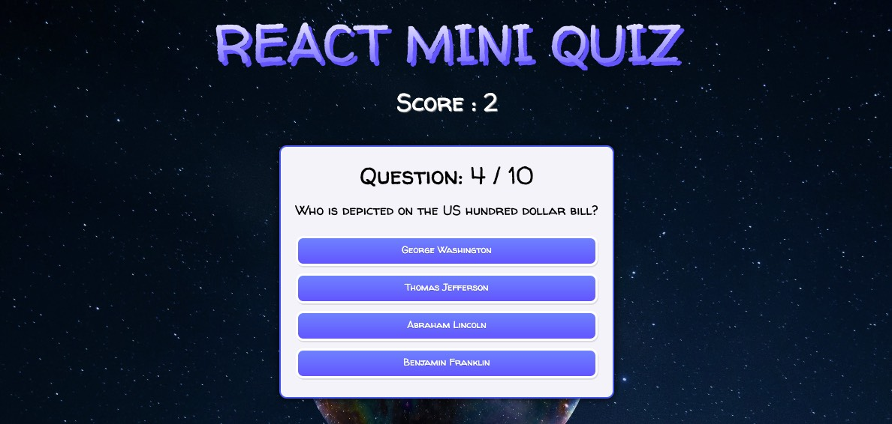

# React Mini Quiz App

간단한 오픈 API를 활용한 일반지식 미니 퀴즈 애플리케이션.

**웹 배포 : [https://miniquizr.netlify.app/](https://miniquizr.netlify.app/)**

#### Made with 🐥 by [Pazival8971](https://github.com/Parzival8971)

---

## 프로젝트 설명

이 프로젝트는 Quiz 애플리케이션을 활용하여, `미니퀴즈`를 만듭니다.
간단한 비동기 API를 사용하여 작업을 수행하였습니다. `React.js`를 사용하고, UI 부분은 `Styled-components`을 사용하였습니다. 이 앱을 만들면서 `State`의 상태관리와 `Typescript` 학습을 중점으로 만들었습니다. 누구나 참고하여 도움이 되었으면 합니다.

---

## 사용한 라이브러리

- [React](https://reactjs.org/)
- [typescript](https://www.typescriptlang.org/)
- [axios](https://github.com/axios/axios)
- [styled-components](https://styled-components.com/)

## 요구사항

- 기초적인 React.js 지식
- 기초적인 HTML, CSS, Styled-components 지식
- 기초적인 Typescript 지식

## 시작하기

시작 파일을 가져온 후 파일 디렉토리로 이동하여 다음을 시행합니다.

```shell
npm install
```

그러고 난 후 개발 서버를 띄어주세요.

```shell
npm start
```

## 사용한 에디터

코드 에디터 : [VS Code](https://code.visualstudio.com/)

---

공부하자 달려라! 🔥
